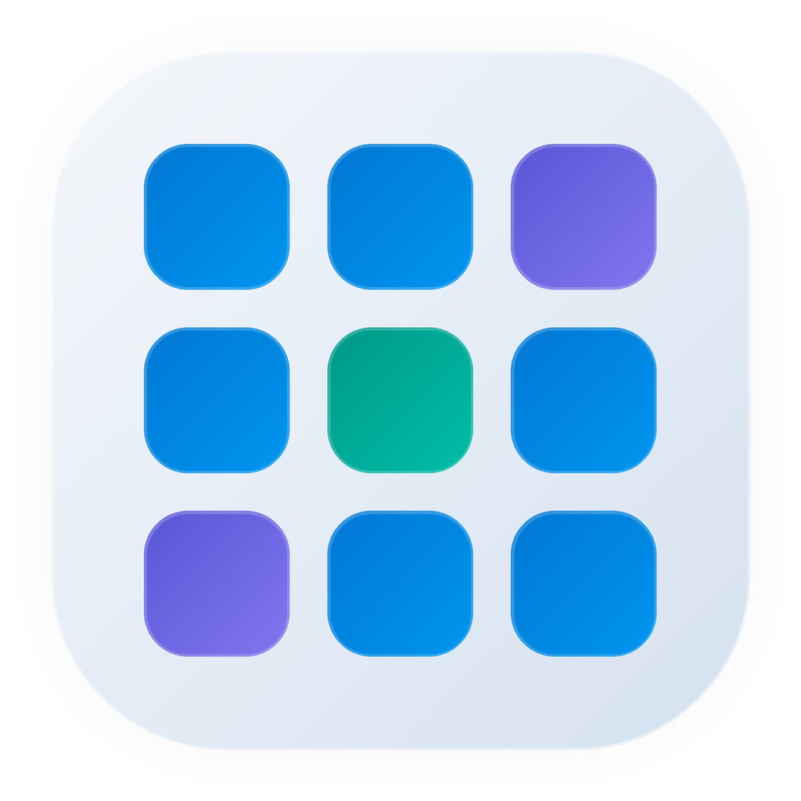
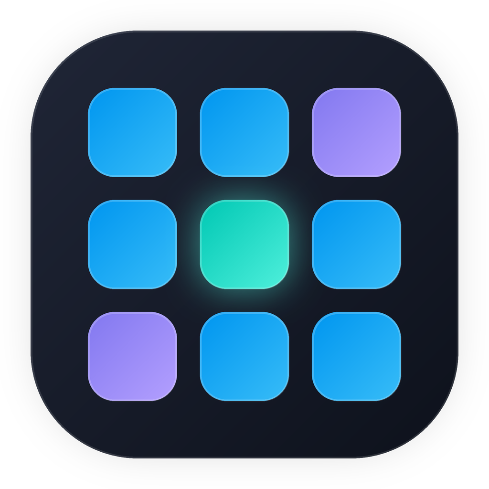

<div align="center">

<!-- Light mode & dark mode icons are generated from generate_icon.py. -->
<!-- Light: ./StartPage_Icon_light_1024.png | Dark: ./StartPage_Icon_dark_1024.png -->



<h1>StartPage</h1>

<p>一款面向 Windows 的原生应用启动页,灵感来自 macOS Launchpad。</p>
<p>使用 WinUI 3 + .NET 8 打造,主打快速搜索、整洁网格与高质量图标展示。</p>

<p>
  
  
  
  
</p>

<p align="center">
  
  &nbsp;&nbsp;&nbsp;&nbsp;
  
</p>
<p align="center">
  <sub><b>Light</b> &nbsp;·&nbsp; <b>Dark</b> &nbsp;·&nbsp; 1024 × 1024</sub>
</p>

</div>

---

> StartPage 的目标，是把 Windows 上“找应用、开应用”这件事，变得像 Launchpad 一样直观、快速、安静。

## 项目简介

StartPage 是一个基于 **C# / WinUI 3 / Windows App SDK / .NET 8** 的 Windows 原生启动器应用。
它会自动收集本机已安装应用，并以类 Launchpad 的网格方式展示，支持搜索、启动、打开文件位置和以管理员身份运行等常用操作。

当前版本重点优化了应用发现与图标处理流程，尽可能让图标在圆角卡片内完整显示、减少黑边，并保持统一的视觉观感。

## 功能特性

| 功能 | 说明 |
| --- | --- |
| 原生外观 | WinUI 3 界面、Mica 背景、圆角卡片、悬停与按下反馈，贴近 Windows 11 的系统级视觉风格。 |
| 应用发现与缓存 | 首次扫描开始菜单快捷方式、注册表卸载项与 UWP / Microsoft Store 应用；后续启动优先从本地目录缓存加载，并在后台刷新。 |
| 智能图标 | 从快捷方式、目标文件、注册表图标和包资源中提取图标，并进行缓存、裁剪与缩放处理。 |
| 图标展示 | 尽可能让图标填满圆角矩形区域，减少留白与黑边，让整体网格更统一。 |
| 实时搜索 | 顶部搜索框支持即时过滤，输入即可定位应用。 |
| 快速启动 | 单击即可启动应用，支持快捷方式、桌面程序与 UWP 应用。 |
| 右键操作 | 支持打开文件位置、以管理员身份运行等常用快捷操作。 |
| 状态反馈 | 加载、搜索无结果与异常状态均有明确提示，便于使用与排查。 |

## 技术栈

| 技术 | 用途 |
| --- | --- |
| C# | 主开发语言 |
| .NET 8 | 运行时与基础框架 |
| WinUI 3 | Windows 原生 UI 框架 |
| Windows App SDK | 窗口、Mica 与现代 Windows API 支持 |
| XAML | 界面布局与数据绑定 |
| MVVM | 状态管理与 UI 解耦 |
| System.Drawing.Common | Win32 图标提取、裁剪与缓存 |

## 系统要求

- Windows 10 1809 及以上
- **推荐 Windows 11**，以获得最佳 Mica 与视觉效果
- .NET 8 SDK
- Visual Studio 2022（建议同时安装以下工作负载）
  - .NET 桌面开发
  - 使用 C++ 的桌面开发

## 快速开始

### 1. 克隆仓库

```powershell
git clone https://github.com/<your-username>/StartPage.git
cd StartPage
```

### 2. 本地运行

本项目是 **单项目 MSIX / WinUI 3 应用**。为了获得正确的包身份与窗口行为，建议通过仓库根目录下的脚本启动：

```powershell
powershell -ExecutionPolicy Bypass -File .\Run-StartPage.ps1 -Build
```

如果已经完成构建，也可以直接启动：

```powershell
powershell -ExecutionPolicy Bypass -File .\Run-StartPage.ps1
```

### 3. 手动构建

```powershell
dotnet build .\StartPage.slnx -p:Platform=x64 -p:Configuration=Debug
```

构建产物通常位于：

```text
StartPage\bin\x64\Debug\net8.0-windows10.0.19041.0\win-x64\
```

### 4. 取消开发注册

如果你不再需要本地注册的开发包，可以执行：

```powershell
powershell -ExecutionPolicy Bypass -File .\Unregister-StartPage.ps1
```

### 5. 使用 Visual Studio 调试

1. 打开 `StartPage.slnx`
2. 选择 `x64` 平台
3. 选择 `Debug` 或 `Release`
4. 直接运行项目

## 项目结构

```text
StartPage/
├── StartPage.slnx
├── README.md
├── Run-StartPage.ps1
├── Unregister-StartPage.ps1
├── StartPage_Plan.md
├── generate_icon.py          # 浅色/深色模式图标生成脚本
├── apply_assets.py           # 一键替换 Assets/ 占位图
├── StartPage_Icon_light_1024.png
├── StartPage_Icon_dark_1024.png
├── StartPage_Icon_light.png  (512)
├── StartPage_Icon_dark.png   (512)
└── StartPage/
    ├── Assets/                   # 应用资源与图标
    ├── Models/                   # 数据模型
    ├── Services/                 # 应用发现、启动、图标处理
    ├── ViewModels/               # 主界面状态与过滤逻辑
    ├── App.xaml
    ├── App.xaml.cs
    ├── Converters.cs
    ├── Infrastructure.cs
    ├── MainWindow.xaml
    ├── MainWindow.xaml.cs
    ├── Package.appxmanifest
    └── StartPage.csproj
```

> 重新生成图标:`python generate_icon.py` 产出 512 / 1024 像素版本;
> 重新写入 `StartPage/Assets/` 占位图:`python apply_assets.py`。

## 开发说明

- 应用发现优先覆盖以下来源：
  - 开始菜单快捷方式
  - 注册表卸载项中的桌面应用
  - UWP / Microsoft Store 应用
- 图标提取会优先尝试多个来源，并生成本地图标缓存。
- 图标缓存默认存放在：

```text
%LOCALAPPDATA%\StartPage\IconCache
```

- 应用目录缓存默认存放在：

```text
%LOCALAPPDATA%\StartPage\Cache\apps.json
```

  首次启动会完成完整扫描并写入缓存；后续启动会先显示缓存结果，再在后台刷新应用列表。点击“刷新”会直接执行完整扫描并更新缓存。

- “以管理员身份运行”会触发 Windows 的 UAC 提示，这是系统正常行为。
- UWP 应用可正常启动，但不支持“以管理员身份运行”。

## 当前进度

### 已实现

- [x] WinUI 3 主窗口与 Mica 背景
- [x] 应用网格展示
- [x] 应用搜索与过滤
- [x] 开始菜单快捷方式扫描
- [x] 注册表卸载项扫描
- [x] UWP / Microsoft Store 应用发现
- [x] 应用启动与错误提示
- [x] 打开文件位置
- [x] 以管理员身份运行
- [x] 图标提取、裁剪、缓存与显示优化

### 后续规划

- [ ] 设置页面
- [ ] 更细腻的交互动效
- [ ] 响应式布局优化
- [ ] 个性化主题与背景配置
- [ ] 本地设置持久化
- [ ] 更完整的异常与权限处理
- [ ] 多语言支持
- [ ] 发布与打包流程完善

## 贡献指南

欢迎提交 Issue 或 Pull Request。

建议在提交前确认：

- 功能描述清晰
- 修改范围尽量集中
- 提供必要截图或录屏
- 已完成本地构建验证

## 许可证

本项目当前尚未附带正式开源许可证。

如果你计划公开发布到 GitHub，建议在仓库根目录补充 `LICENSE` 文件，例如：

- MIT License
- Apache License 2.0
- GPL-3.0 License

## 致谢

感谢以下项目与技术生态为 StartPage 提供支持：

- [.NET](https://dotnet.microsoft.com/)
- [Windows App SDK](https://learn.microsoft.com/windows/apps/windows-app-sdk/)
- [WinUI](https://learn.microsoft.com/windows/apps/winui/)
- [Fluent Design System](https://fluent2.microsoft.design/)

